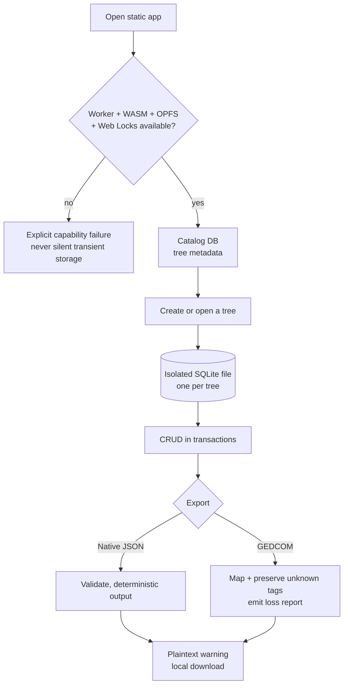

<!-- snapshot: v0.1 | frozen: 2026-07-12 | superseded by v0.2 -->

# Target UX Workflows

## Workspace first

The first screen is the usable local workspace, not a marketing landing page. It shows local trees and clear actions to create or import. Empty, loading, unsupported-browser, storage-denied, and recovery states are first-class.

## Tree editor

- Canvas occupies the primary surface; details/editing use a side panel on desktop and full-height sheet on mobile.
- Search and reference-person controls remain reachable without covering the graph.
- Pan, zoom, fit selection, focus branch, generation depth, and collapse controls have stable dimensions and keyboard equivalents.
- The graph renders only a focused subset and explains when nodes are hidden by the 500-node view guard.

## Data entry

- Quick add captures name, relationship context, and minimum required facts.
- Full edit organizes identity, dates, life status, contact, biography, sources, and privacy classification.
- Relationship creation is explicit about partner/union and biological/adoptive parentage; no directional plus button may silently invent an unsupported relationship.
- Validation happens before commit and errors preserve form input.

## Import/export

- Import always shows format, counts, warnings, and loss/extension handling before commit.
- Native import creates a new tree by default to prevent accidental overwrite.
- Export begins with scope/privacy selection, then format choice, then plaintext warning.

## Diagnostics and trust

- Footer/about exposes AGPL license, GitHub source, build version, and commit SHA.
- Error dialog previews sanitized diagnostics and offers explicit copy/download/GitHub/contact actions.
- No analytics consent banner is needed because there is no analytics.

## Accessibility and localization

- Vietnamese is the default product language; English remains supported through complete dictionaries rather than scattered conditionals.
- All icon-only controls have labels/tooltips; focus order, contrast, reduced motion, screen reader names, and touch targets are tested.

---

# Product and Data Flows

## Create and reopen a tree

1. User opens the hosted or self-hosted static app.
2. App feature-detects Worker, WASM, OPFS, Web Locks, and persistent storage.
3. User creates tree metadata and optionally adds any first person.
4. User may choose a reference person later; it is not required to be the app user.
5. Every mutation runs in a SQLite transaction and persists locally.

## Native import

1. User selects a local JSON file; the browser does not upload it.
2. Worker validates size, format version, schema, IDs, and referential integrity.
3. App shows counts, warnings, unsupported data, and destination choice.
4. User confirms; import commits atomically into a new tree by default.

## GEDCOM import/export

1. Adapter detects GEDCOM version and encoding.
2. Parser maps supported records into the canonical domain and preserves unknown extensions.
3. Preview reports assumptions, conflicts, and fields that cannot be represented.
4. Export selects GEDCOM 7 or compatibility 5.5.1 and emits a loss report when needed.

## Plaintext export

1. User chooses full tree or branch and selects privacy fields.
2. App warns that the resulting file is readable by anyone who receives it.
3. Export is generated locally and downloaded directly.

## Error reporting

1. Error boundary captures an error locally.
2. Diagnostic builder removes family values and includes app SHA, browser, operation, sanitized stack, and aggregate counts only.
3. User previews and explicitly chooses copy/download, GitHub Issue, or maintainer contact.
4. Nothing is sent automatically.

## Future linked-source update

Bundles will carry stable source/tree/record IDs. A later workflow may compare a new source snapshot, suggest matches, show field-level diffs, require approval, and store a rollbackable change set. No automatic synchronization is implied.

---

## Tree lifecycle

