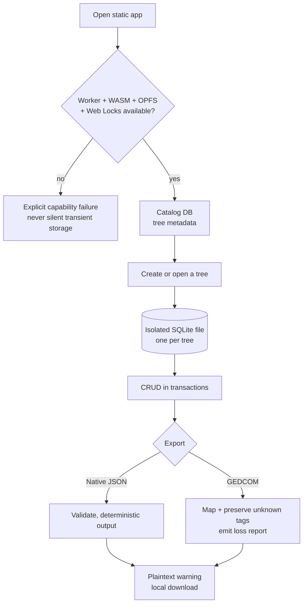
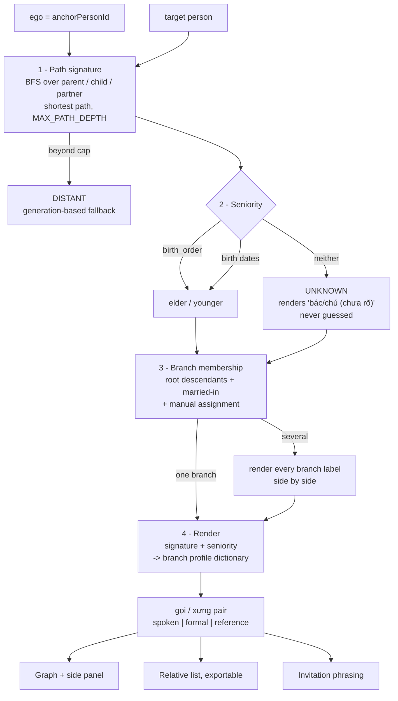
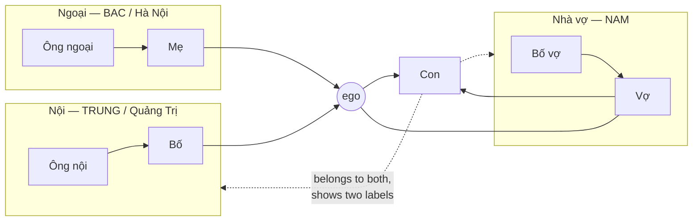
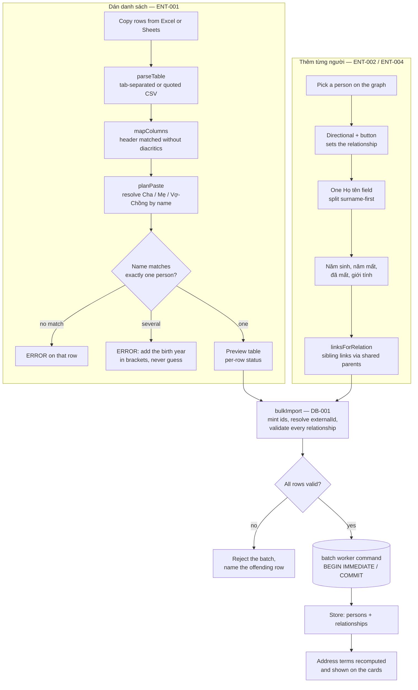
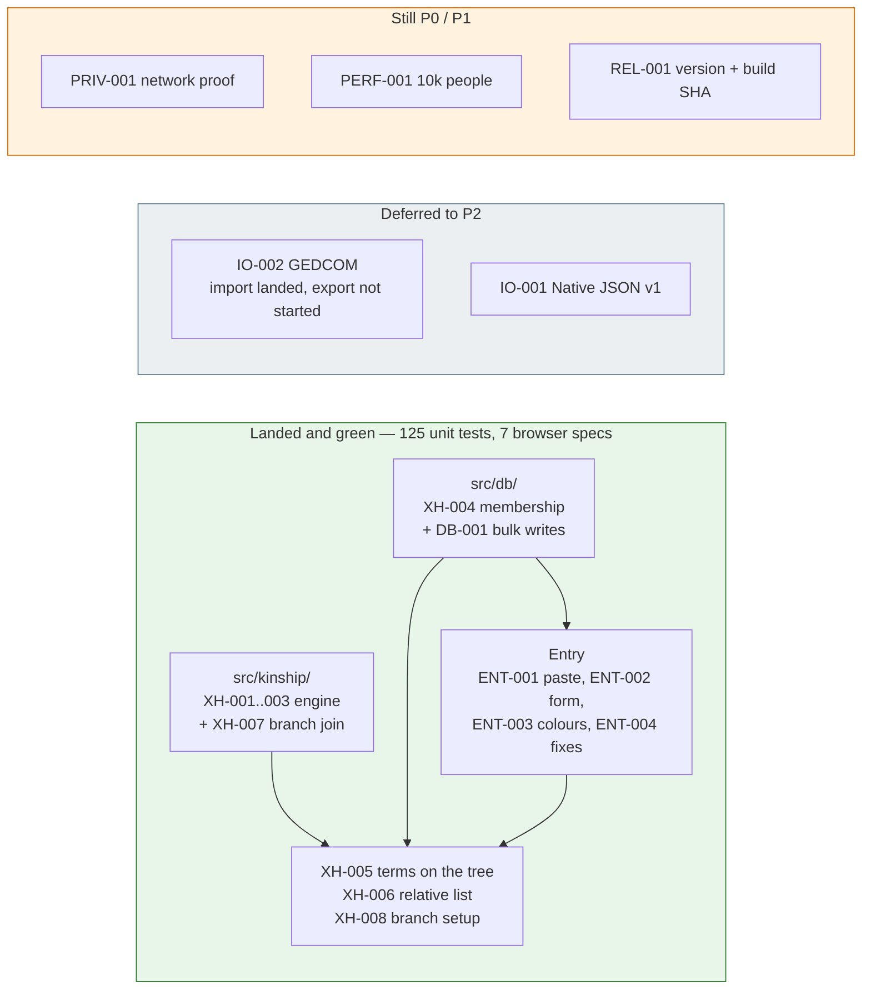

<!-- snapshot: v0.2 | current | updated: 2026-08-17 -->

# Target UX Workflows

## Workspace first

The first screen is the usable local workspace, not a marketing landing page. It shows local trees and clear actions to create or import. Empty, loading, unsupported-browser, storage-denied, and recovery states are first-class.

## Tree editor

- Canvas occupies the primary surface; details/editing use a side panel on desktop and full-height sheet on mobile.
- Search and reference-person controls remain reachable without covering the graph.
- Pan, zoom, fit selection, focus branch, generation depth, and collapse controls have stable dimensions and keyboard equivalents.
- The graph renders only a focused subset and explains when nodes are hidden by the 500-node view guard.

## Data entry

Two paths, both committing through one transactional write (`DB-001`).

- **Quick add** captures full name, birth year, death year, life status, gender, and the
  relationship to the person in focus. The name is typed as one field and split
  surname-first, with a manual override for names the rule gets wrong. Saving keeps the
  surname, gender, and relationship so a run of siblings needs only the given name typed.
- **Paste a list** takes a spreadsheet copy, maps its header, and shows a per-row preview
  with errors and warnings before anything is written.
- Birth year is a first-class field on both paths because seniority — and therefore
  `bác` versus `chú` — cannot be resolved without it.
- Relationship creation is explicit about partner and biological/adoptive parentage; a
  directional plus button never silently invents an unsupported relationship. Siblings are
  stored through shared parents, and the form refuses when no parent is known.
- Validation happens before commit and errors preserve form input.

## Import/export

- Import always shows format, counts, warnings, and loss/extension handling before commit.
- Native import creates a new tree by default to prevent accidental overwrite.
- Export begins with scope/privacy selection, then format choice, then plaintext warning.

## Diagnostics and trust

- Footer/about exposes AGPL license, GitHub source, build version, and commit SHA.
- Error dialog previews sanitized diagnostics and offers explicit copy/download/GitHub/contact actions.
- No analytics consent banner is needed because there is no analytics.

## Accessibility and localization

- Vietnamese is the default product language; English remains supported through complete dictionaries rather than scattered conditionals.
- All icon-only controls have labels/tooltips; focus order, contrast, reduced motion, screen reader names, and touch targets are tested.

---

# Product and Data Flows

## Create and reopen a tree

1. User opens the hosted or self-hosted static app.
2. App feature-detects Worker, WASM, OPFS, Web Locks, and persistent storage.
3. User creates tree metadata and optionally adds any first person.
4. User may choose a reference person later; it is not required to be the app user.
5. Every mutation runs in a SQLite transaction and persists locally.

## Native import

1. User selects a local JSON file; the browser does not upload it.
2. Worker validates size, format version, schema, IDs, and referential integrity.
3. App shows counts, warnings, unsupported data, and destination choice.
4. User confirms; import commits atomically into a new tree by default.

## GEDCOM import/export

1. Adapter detects GEDCOM version and encoding.
2. Parser maps supported records into the canonical domain and preserves unknown extensions.
3. Preview reports assumptions, conflicts, and fields that cannot be represented.
4. Export selects GEDCOM 7 or compatibility 5.5.1 and emits a loss report when needed.

## Plaintext export

1. User chooses full tree or branch and selects privacy fields.
2. App warns that the resulting file is readable by anyone who receives it.
3. Export is generated locally and downloaded directly.

## Error reporting

1. Error boundary captures an error locally.
2. Diagnostic builder removes family values and includes app SHA, browser, operation, sanitized stack, and aggregate counts only.
3. User previews and explicitly chooses copy/download, GitHub Issue, or maintainer contact.
4. Nothing is sent automatically.

## Future linked-source update

Bundles will carry stable source/tree/record IDs. A later workflow may compare a new source snapshot, suggest matches, show field-level diffs, require approval, and store a rollbackable change set. No automatic synchronization is implied.

---

## Tree lifecycle

## Xưng hô resolution

## Branch profiles

Ego addresses the spouse's branch in the spouse's register — "gọi thay ngôi". The signature
is recomputed with the spouse as ego and rendered in that branch's profile, so ego calls the
wife's maternal uncle `cậu` despite having no blood path that would produce it.

---

## Data entry paths

Saving keeps the surname, gender, and relationship in the form, so entering a run of
children costs one given name and `Ctrl`+`Enter` each. A row the importer cannot resolve is
excluded from the commit and the button states how many it is skipping — a partial import is
always a stated choice.

## Delivery state

The founder's two dated outcomes are served: a relative list with a gọi/xưng pair per
person for wedding invitations, and address terms visible on the tree while entering it.
What remains is release hygiene rather than feature work — a test proving no family data
reaches the network, a 10,000-person benchmark, and a visible build SHA.
